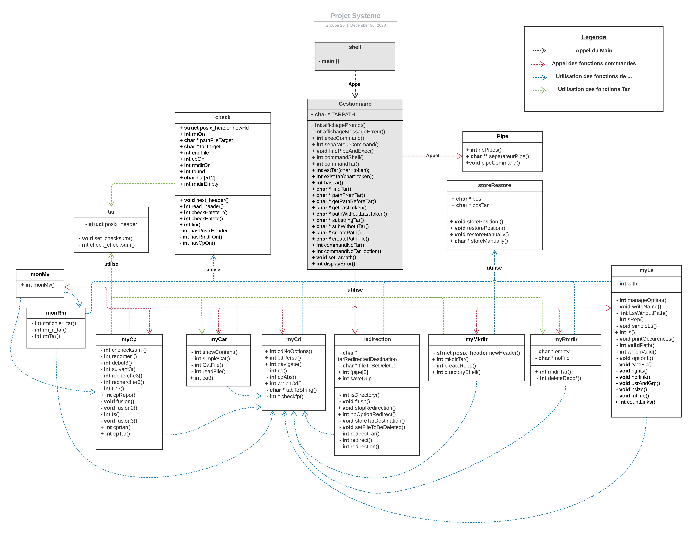

==================

## shell.c

ce fichier contient le main de notre projet, il permet de lancer la boucle
interactive qui recupere les commandes de l'utilsateur.

## gestionnaire.c

Fichier qui regroupe toutes les fonctions qui permet de :

* parser la ligne de commande de l'utilisateur
* appeler les commandes Unix, Tar de personnalisees
* savoir si on est dans un tar ou pas
* recuperation de char * utile pour les autres fonctions exterieurs
* afficher le chemin du dossier courant et messages d'erreurs.

## myCd.c

La fonction navigate permet de se deplacer dans un tar
La fonction cdPerso permet de se deplacer hors du tar
la fonction cdAbs permet de se deplacer avec un path Absolu
Cd est utilisee pour les commandes :

* cat, mkdir, rmdir, ls, cp, rm, mv

## myLs.c

La fonction ls permet de lister le contenu d'un dossier dans un tar,
prends en compte l'option -l.

## myCat.c

La fonction cat permet d'afficher le contenu d'un fichier dans un tar.

## myMkdir.c

Creation d'un nouveau ou plusieurs posix_header contenant les informations 
d'un dossier vide, et l'ajoute a la fin d'un fichier tar.

## check.c

Verifie les entetes du fichier tar, et execute les commandes :

* mkdir, rmdir, cp, mv, rm

## myRmdir.c

* Suppression d'un ou plusieurs entete d'un dossier dans un tar,
et re positionne correctement les fichiers du tar.

## monrm.c

* Supprime un ou plusieurs entete (fichier ou dossier avec l'option -r)
* utilise un fichier tampon pour deplacer et les rearranger afin d'eviter les "trous"

## myCp.c

* Copie un ou plusieurs entete (fichier ou dossier avec l'option -r)
* `cp -r` ne fonctionne que dans le tar, c'est a dire que la commande ne peut pas copier un fichier hors du tar vers le tar et inversement,

## monmv.c

Utilise les fonctions cp + rm

## pipe.c

* On commence par recuperer le nombre de pipe a effectue,
* puis on creer un tableau de taille nombre de pipe qui contient toutes les commandes.
* puis pour chaque commande on redirige le resultat de la commande vers stdout pour la commande d'apres qui fait une lecture dans le stdin etc...
## storeRestore.c

Sauvegarde sa position, et reinitialise sa position avant l'execution
d'une commande.

## redirection.c

Redirige le flux stdin vers un fichier, ne redirige pas vers un fichier
dans un tar.

